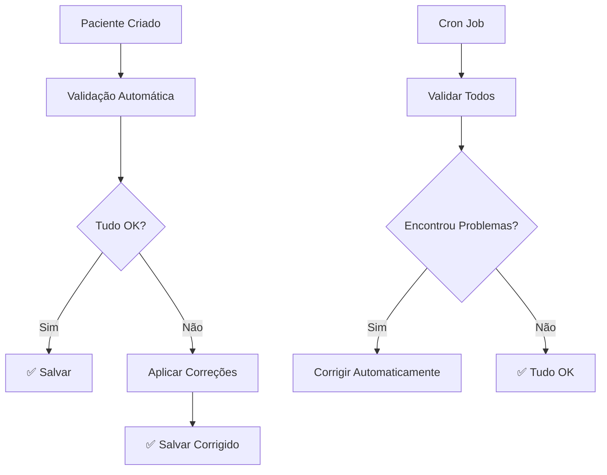

# 🤖 Sistema de Validação Automática de Pacientes

## 📋 Visão Geral

O sistema agora possui **validação e correção automática** de pacientes para garantir que todos os dados estejam consistentes entre Firebase Authentication e Firestore.

**Você não precisa mais fazer verificações manuais!** ✅

---

## 🎯 O Que Foi Implementado

### 1. **Validação Automática na Criação**
- Sempre que um paciente é criado via `/api/prescriber/patients/create`
- O sistema valida automaticamente:
  - ✅ Usuário existe no Firebase Auth
  - ✅ Documento existe no Firestore
  - ✅ `prescriberId` está definido
  - ✅ Custom claims corretos (`role: patient`)
  - ✅ Dados consistentes entre Auth e Firestore

### 2. **Cron Job Automático**
- Roda **a cada 6 horas** (00:00, 06:00, 12:00, 18:00)
- Verifica **todos os pacientes** automaticamente
- Corrige qualquer inconsistência encontrada
- **Validação inicial**: 2 minutos após o servidor iniciar

### 3. **Endpoint Manual** (Opcional)
- Para executar validação sob demanda
- Útil para troubleshooting
- Endpoint: `POST /api/admin/validate-patients`

---

## 🔧 Como Funciona

### Validação Automática

Quando um paciente é criado ou validado, o sistema verifica:

```
1. Firebase Authentication
   ├─ Usuário existe? ❌ → Criar usuário
   ├─ Custom claims corretos? ❌ → Atualizar para role: patient
   └─ DisplayName correto? ❌ → Atualizar

2. Firestore
   ├─ Documento existe? ❌ → Criar documento
   ├─ prescriberId definido? ❌ → Atribuir prescritor
   └─ Dados completos? ❌ → Completar dados

3. Consistência
   ├─ Auth ⟷ Firestore sincronizados? ❌ → Sincronizar
   └─ Todos os campos obrigatórios? ❌ → Preencher
```

### Correções Automáticas

O sistema aplica estas correções automaticamente:

| Problema | Correção Automática |
|----------|-------------------|
| Usuário sem Auth | Cria usuário no Firebase Auth |
| Usuário sem Firestore | Cria documento no Firestore |
| Sem `prescriberId` | Atribui ao primeiro prescritor disponível |
| Custom claims errados | Atualiza para `role: patient` |
| Dados inconsistentes | Sincroniza Auth ⟷ Firestore |

---

## 📅 Agenda de Execução

### Automático (Cron Jobs)

```bash
🕐 00:00 → Validação automática de todos os pacientes
🕐 06:00 → Validação automática de todos os pacientes
🕐 12:00 → Validação automática de todos os pacientes
🕐 18:00 → Validação automática de todos os pacientes

🚀 Inicial → 2 minutos após servidor iniciar
```

### Manual (Quando Necessário)

```bash
# Executar validação manual
curl -X POST https://web-production-c9eaf.up.railway.app/api/admin/validate-patients \
  -H "Authorization: Bearer SEU_ID_TOKEN" \
  -H "Content-Type: application/json"
```

---

## 🚀 Como Usar

### Não Fazer Nada! 🎉

O sistema funciona automaticamente. Você só precisa:

1. **Criar pacientes normalmente** via interface ou API
2. **Deixar o servidor rodando**
3. **Relaxar** - o sistema cuida do resto!

### Executar Validação Manual (Opcional)

Se quiser forçar uma validação imediata:

```bash
# 1. Gerar ID Token
node get-id-token.js

# 2. Executar validação
curl -X POST https://web-production-c9eaf.up.railway.app/api/admin/validate-patients \
  -H "Authorization: Bearer SEU_TOKEN" \
  -H "Content-Type: application/json"
```

---

## 📊 Logs e Monitoramento

### Logs do Cron Job

O sistema registra automaticamente no console:

```
🕐 [CRON] Iniciando cron jobs...
✅ [CRON] Cron jobs configurados:
   - Validação de pacientes: a cada 6 horas
   - Validação inicial: em 2 minutos

🔧 [CRON] Starting scheduled patient validation...
📋 [VALIDATOR] Found 15 patients to validate
✅ [VALIDATOR] Validation complete: 3 patients fixed

📋 [CRON] Details:
   - patient1@example.com: Added missing prescriberId
   - patient2@example.com: Created user in Firebase Authentication
   - patient3@example.com: Updated custom claims to patient role
```

### Logs da Criação

Quando um paciente é criado:

```
📝 [PRESCRIBER] Creating user...
🔧 [PRESCRIBER] Running automatic validation...
✅ [PRESCRIBER] Auto-fixes applied: ['prescriberId assigned']
✅ [PRESCRIBER] Onboarding email sent to: patient@example.com
```

---

## 🛠️ Arquitetura

### Arquivos Criados

```
services/
├── patient-validator.js       # Lógica de validação
└── cron-jobs.js               # Agendamento automático

routes/
├── prescriber.js              # ✅ Validação automática adicionada
└── admin.js                   # ✅ Endpoint manual adicionado

server.js                      # ✅ Cron jobs iniciados
package.json                   # ✅ node-cron adicionado
```

### Fluxo de Validação



---

## 🎯 Benefícios

### Antes (Manual)
```
❌ Tinha que rodar script manualmente
❌ Dependia de lembrar de verificar
❌ Pacientes podiam ficar com dados inconsistentes
❌ Erros só descobertos quando usuário reclamava
```

### Agora (Automático)
```
✅ Validação automática 4x por dia
✅ Correção imediata na criação
✅ Zero intervenção manual
✅ Dados sempre consistentes
✅ Logs completos de todas as ações
```

---

## 🔍 Troubleshooting

### Ver Status dos Cron Jobs

Os logs aparecem automaticamente no console do servidor.

### Desabilitar Validação Automática (Se Necessário)

Edite `server.js` e comente a linha:

```javascript
// startCronJobs(); // Desabilitado temporariamente
```

### Alterar Frequência de Validação

Edite `services/cron-jobs.js`:

```javascript
// Altere de 6 em 6 horas para outra frequência
cron.schedule('0 */6 * * *', async () => { ... });

// Exemplos:
// '0 * * * *'      → A cada hora
// '0 */12 * * *'   → A cada 12 horas
// '0 0 * * *'      → Uma vez por dia (meia-noite)
```

---

## ✅ Resumo

### O que você precisa fazer:
**NADA!** 🎉

### O que o sistema faz automaticamente:
1. ✅ Valida pacientes na criação
2. ✅ Verifica todos os pacientes a cada 6 horas
3. ✅ Corrige automaticamente qualquer problema
4. ✅ Registra tudo nos logs
5. ✅ Garante dados sempre consistentes

### Quando usar validação manual:
- Depois de migração de dados
- Para troubleshooting específico
- Quando quiser forçar verificação imediata

---

## 📚 Documentação Relacionada

- `get-id-token.js` - Gerar token para APIs admin
- `admin-fix-patients.sh` - Script manual (backup)
- `COMO-OBTER-FIREBASE-TOKEN.md` - Como obter tokens

---

## 🎉 Pronto!

O sistema agora funciona **100% automaticamente**. Você não precisa mais se preocupar com validações manuais!

**Apenas mantenha o servidor rodando e tudo será cuidado automaticamente.** 🚀

